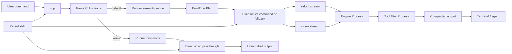
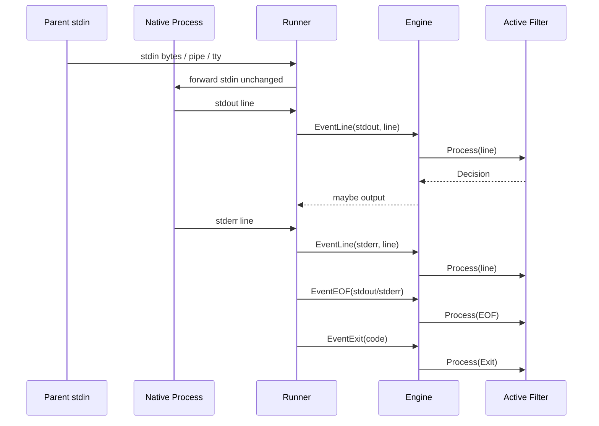

# Command Compression Proxy Architecture

## Purpose

`ccp` is an agent-first command proxy:

- Runs native commands.
- Compacts output to reduce bytes/tokens sent to coding agents.
- Preserves execution correctness (exit code, actionable diagnostics).

This document explains the runtime architecture, benchmark architecture, and test boundaries.

## High-Level Components

- `cmd/ccp`: CLI entrypoint and runtime wiring.
- `cmd/coverage-gate`: coverage gate CLI for enforcing internal package thresholds in CI.
- `internal/runner`: command planning + process execution + stream routing.
- `internal/engine`: stream processing engine and dispatch.
- `internal/engine/filters`: tool-specific and subcommand-specific compaction logic.
- `internal/quality/coverage`: coverage profile parsing and internal-scope aggregation logic.
- `internal/metrics`: [bbolt](https://github.com/etcd-io/bbolt)-backed runtime metric persistence and summary aggregation.
- `internal/lifecycle`: CLI lifecycle hooks and coding agent integration entrypoints.
- `internal/lifecycle/agents`: Coding agent specific integrators.
- `tools/benchmark`: separate benchmark module (`ccp-ci`) for scenario execution/reporting.
- `testdata/tool-fixtures`: benchmark scenarios, projects, and expected outputs.

## End-to-End Runtime Flow

## Planning Layer (`internal/runner/plan.go`)

Planner responsibilities:

- Identify command/tool and resolve filter from registry.
- Call filter `Prepare(args)` to get:
  - normalized args,
  - dispatch key,
  - passthrough/ambiguity markers,
  - optional preferred substitution with fallback.
- Build `ExecPlan` used by runner.

Key point:

- Planning is where **command** shape rewrites happen (for example normalized args, preferred backend substitution).
- Filters can force neutral passthrough for unsafe/ambiguous shapes.

## Execution Layer (`internal/runner/runner.go`)

Runner responsibilities:

- Execute planned command (`exec.Command`).
- Forward parent stdin to wrapped command execution for semantic and raw paths.
- Read `stdout` and `stderr` concurrently.
- Send line events + EOF/tick/exit events into the engine.
- Emit final exit code from the wrapped process.
- Record execution diagnostics in metrics, including dispatch metadata tags such as stdin mode (`stdin=pipe|tty|none`).

Important modes:

- `--raw`: bypass semantic engine; direct passthrough.
- `--capture-raw` / `--capture-raw-dir`: capture sequenced raw stdout/stderr files while preserving normal execution.
- ambiguous shell or low-confidence planner shapes: use safe permissive fallback with neutral filtering.

## Engine + Filter Layer (`internal/engine`)

The engine dispatches stream events to the active filter context.

Event types include:

- line,
- EOF,
- tick (stale flush cadence),
- exit.

Filters implement:

- `Prepare(args)` for planning-time decisions.
- `ContextKey(ev)` for state isolation.
- `Process(ev, mem)` for runtime compaction decisions.

Decision actions include immediate output, collect, ignore, and flush.

## Filter Structure

- Single-command filters: one file + one test.
- Parent tools (for example `git`, `go`, `docker`, `kubectl`, `npx`, `cargo`):
  - parent filter routes subcommands through `ToolFilterRegistry`,
  - subcommand filters live in `internal/engine/filters/<parent>/`,
  - one subcommand per file + test.

## Data Flow: Streams and Shared Context

## Benchmark Architecture (`tools/benchmark`)

The benchmark harness is a separate module and binary path:

- Entrypoint: `tools/benchmark/cmd/ccp-ci`.
- Scenarios loaded from `testdata/tool-fixtures/<tool>/scenarios.json`.

For each scenario, harness executes:

1. First pass (warmup):
   - avoids accidental overhead caused by cold starts.
1. Second pass (measured):
   - native command,
   - proxied command (`ccp ...`),
   - compares safety invariants and token compaction.
2. Third pass (artifact capture):
   - `ccp --capture-raw ...` to write `input-stdout.txt`/`input-stderr.txt`,
   - `ccp ...` output capture to `output.txt`.

Hooks:

- `before_start` and `after_stop` run for each pass.

Outputs:

- per-scenario artifacts in benchmark artifacts dir,
- `report.json`,
- CI summary tables grouped by tool.

## Tool Fixtures and Integration Tests

`testdata/tool-fixtures` is the shared source for:

- benchmark scenarios/projects,
- filter replay validation.

`internal/engine/filters/tool_fixtures_integration_test.go`:

- Replays fixture input streams through engine/filter logic.
- Uses scenario metadata (`must_contain`/`must_not_contain`, etc.).
- Validates compaction behavior deterministically at filter-engine layer.

Boundary note:

- This integration test validates filter-engine behavior from fixture streams.
- Planner/exec correctness is validated in runner plan/integration tests and benchmark harness.

## Testing Layers

- Unit tests: per-filter logic and helpers.
- Planner tests: `internal/runner/plan_<tool>_test.go`.
- Runner integration tests: `internal/runner/runner_<tool>_integration_test.go`.
- Fixture replay integration: `internal/engine/filters/tool_fixtures_integration_test.go`.
- Benchmark CI: `tools/benchmark` with scenario-driven command execution.
- Quality gates: `go test -count=1 -race ./...` and `cmd/coverage-gate` coverage threshold checks for `internal/...`.

## Performance Baselines

- Performance baseline metrics are tracked in implementation artifacts (for example OpenSpec implementation notes and benchmark outputs) rather than hardcoded in this architecture document.
- Any tuning in runner, engine, or filter hot paths should refresh benchmark artifacts and compare against the latest recorded baselines.

## Design Invariants

- Exit code parity with native command.
- Preserve critical diagnostics.
- Aggressive compaction of repetitive low-signal output.
- Fallback/passthrough for ambiguous or unsafe command shapes.
- Deterministic benchmark and fixture-driven validation.
