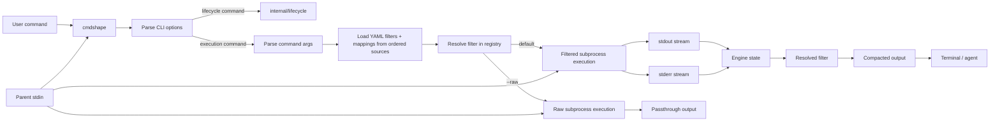

# cmdshape Architecture

## Purpose

`cmdshape` is a command compression proxy for coding agents:

- runs native commands
- compacts output to reduce bytes/tokens sent to coding agents
- preserves execution correctness, especially exit code and actionable diagnostics

The implementation is split between one canonical Go runtime under `internal/`
and YAML-authored filter definitions loaded at runtime.

## High-Level Components

- `cmd/cmdshape`: CLI entrypoint and runtime wiring
- `cmd/coverage-gate`: coverage gate CLI for enforcing internal package thresholds
- `internal/`: canonical runtime packages
- `internal/contracts`: stable runtime command/filter contracts
- `internal/engine`: streaming engine and ordered retained-output buffer
- `internal/filters`: filter source definitions and registry helpers
- `internal/filters/yaml`: authored YAML schema, validation, loading, and compilation
- `internal/metrics`: runtime metric persistence and gain/history reporting
- `internal/lifecycle`: lifecycle subcommands and coding-agent integration entrypoints
- `internal/lifecycle/agents`: coding-agent specific adapters
- `filters/`: shipped YAML filter definitions and `.mappings.yaml`, embedded into release builds
- `cmd/cmdshape-ci` + `internal/benchmark`: replay benchmark runner for fixture-driven verification and reporting
- `testdata/benchmarks`: benchmark scenarios, replay fixtures, and optional copied projects

## End-to-End Runtime Flow

## Runtime Structure (`internal/`)

The canonical runtime path is:

1. `cmd/cmdshape` parses CLI flags through `internal/cli`.
2. Execution commands build `internal/contracts.Command` through `internal/parser.go`.
3. `internal/runner.go` resolves the active filter sources and loads YAML filters plus mappings.
4. `internal/engine` creates command state and streams stdout/stderr through the resolved filter.
5. `internal/metrics` records one metrics entry for each non-raw execution command.

There is no second legacy runtime path and no built-in Go filter catalog fallback.

## Filter Discovery and Registry

Authored filter behavior comes from YAML, not from a hardcoded Go per-tool
filter catalog.

The runtime source order is explicit in `internal/runner.go`:

- dev builds load only the repository `filters/` directory
- non-dev builds load project-local `./.cmdshape/filters` first, then home-scoped `~/.config/cmdshape/filters`

That order matters because registration is first-wins:

- project YAML filter definitions override home-scoped definitions with the same canonical filter id
- project `.mappings.yaml` aliases override home-scoped aliases with the same key
- mappings are resolved within their own source, so an alias only binds to a target filter that compiled successfully in
  the same directory

The current YAML override order in release builds is therefore source-based:

1. load project-local filter definitions from `./.cmdshape/filters/*.yaml`
2. apply project-local aliases from `./.cmdshape/filters/.mappings.yaml`
3. fill remaining gaps from home-scoped filter definitions in `~/.config/cmdshape/filters/*.yaml`
4. fill remaining alias gaps from `~/.config/cmdshape/filters/.mappings.yaml`

The shipped `filters/` directory is not part of release-build runtime discovery.
Instead, release builds materialize shipped filters into `~/.config/cmdshape/filters`
through lifecycle maintenance.

Safety rules in the loader:

- invalid filter definitions are skipped
- invalid `.mappings.yaml` files are ignored for that source
- duplicate ids or aliases from lower-priority sources are ignored
- missing mapping targets are ignored
- unresolved tools fall back to passthrough

The registry always resolves to a filter, defaulting to passthrough when no
valid filter matches.

## Command and Stream Model

The parsed command carries:

- raw input text
- argv
- canonical tool name
- dispatch key once resolved

The engine handles only `stdout` and `stderr` as filterable streams. `stdin`
remains attached directly to the subprocess.

The ordered buffer:

- retains `keep` output in stream-tagged insertion order
- skips blank lines
- flushes retained output on exit in engine-owned order

## Execution Modes

Supported execution flags:

- `--raw`: bypass semantic compaction and pass through native output
- `--confidential`: redact configured substrings from emitted output and capture artifacts

Lifecycle commands such as `capture`, `filter`, `gain`, `history`, `init`,
`migrate`, `recovery`, `repair`, `uninstall`, `upgrade`, and `verify` are
handled by `internal/lifecycle`.

Current lifecycle split:

- `capture` records native sequenced streams and replay output without changing
  command semantics
- `init` installs or updates supported coding-agent integrations
- `migrate` reports or retries previous-installation state and integration
  cleanup
- `repair` rewrites the fully managed home-scoped cmdshape state under `~/.config/cmdshape`
- maintenance helpers remove obsolete previous-installation state and refresh
  the managed home layout without deleting `~/.cmdshape`
- `upgrade` validates the downloaded archive and then runs rewrite repair
  through the installed binary
- `uninstall` removes managed integration artifacts from each adapter's canonical target

`init` does not own home filter materialization. Canonical shipped filters are
owned by `repair` and startup maintenance.

## Benchmark Architecture (`cmd/cmdshape-ci` + `internal/benchmark`)

The benchmark harness is a separate module and binary path:

- entrypoint: `cmd/cmdshape-ci`
- replay fixtures loaded from `testdata/benchmarks/<tool>/<case>-<invariant>/command.yaml`

For each replay fixture, the harness runs `cmdshape verify`, compares authored
expectations when present, records token counts, and writes per-fixture
artifacts. The harness exercises the live runtime rather than a separate filter
implementation.

Artifact contracts:

- optional sequenced `stdout.txt` / `stderr.txt` replay inputs
- optional authored `output.txt` / `decisions.txt` expectations
- generated `verify-output.txt` / `verify-decisions.txt`

The harness is replay-driven and validates the live runtime without copied
projects by default.

## Testing Layers

- unit tests in the narrowest owning package under `internal/`
- runtime tests in `internal/runner_test.go`, `internal/engine/*_test.go`, and `internal/filters/*_test.go`
- lifecycle and adapter tests under `internal/lifecycle` and `internal/lifecycle/agents`
- benchmark harness tests under `internal/benchmark`
- benchmark fixtures under `testdata/benchmarks`
- validation and race/coverage gates through `./scripts/validate.sh`

## Design Invariants

- exit code parity with the native command
- preserve critical diagnostics
- exact `--raw` behavior unless explicit confidential redaction is enabled
- fallback/passthrough on ambiguity, unsafe structured modes, or invalid filter definitions
- deterministic output and deterministic benchmark evaluation
- authored YAML is the source of truth for filter behavior and alias routing within each source
- project-local YAML overrides home-scoped YAML in release builds
- Go owns the bounded runtime semantics: parsing, source ordering, stream handling, metrics, audit, and lifecycle
  behavior
