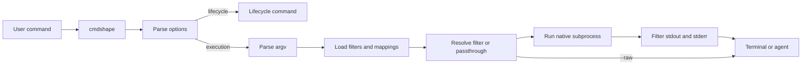

# cmdshape architecture

`cmdshape` is a native-command proxy for coding agents. It resolves a command,
loads one YAML-authored filter when a safe match exists, and compacts output
without replacing the underlying tool. The runtime is Go; filter behavior is
data-driven.

## Components

- `cmd/cmdshape`: CLI entrypoint and runtime wiring.
- `internal/contracts`: stable command and filter contracts.
- `internal/parser.go` and `internal/runner.go`: command parsing, source
  resolution, and execution setup.
- `internal/engine`: ordered stdout/stderr processing and retained output.
- `internal/filters` and `internal/filters/yaml`: filter sources, schema
  validation, compilation, and registry helpers.
- `internal/metrics`: local gain/history persistence and reports.
- `internal/lifecycle`: capture, verification, integrations, repair, recovery,
  upgrade, and uninstall commands.
- `filters/`: shipped YAML definitions embedded into release builds.
- `cmd/cmdshape-ci`, `internal/benchmark`, and `testdata/benchmarks`: replay
  verification and benchmark reporting.

## Runtime flow

Execution commands build an `internal/contracts.Command`, resolve the active
source, stream native stdout and stderr through the engine, and record local
metrics for non-raw runs. Stdin remains attached to the subprocess. Exit
status is returned from the native process.

## Runtime structure

The canonical execution path is:

1. `cmd/cmdshape` parses global flags and distinguishes lifecycle commands from
   native execution.
2. `internal/parser.go` builds `internal/contracts.Command` with the raw input,
   argv, canonical tool, and eventual dispatch key.
3. `internal/runner.go` resolves trusted filter sources, mappings, and the
   effective filter.
4. The native child process inherits stdin while stdout and stderr are read as
   separate streams.
5. `internal/engine` applies the selected YAML case and preserves ordered
   retained output.
6. The runner returns the native exit status and records a local metric for a
   non-raw execution.

There is one Go runtime and no legacy execution path or hardcoded per-tool Go
filter catalog. Tool-specific behavior belongs in YAML. Shared parsing,
streaming, safety, and lifecycle behavior belongs in the owning `internal/`
package.

## Filter sources and safety

Release builds use this precedence:

1. trusted project-local `./.cmdshape/filters/*.yaml`;
2. trusted project-local `./.cmdshape/filters/.mappings.yaml`;
3. home-scoped `~/.config/cmdshape/filters/*.yaml`;
4. home-scoped `~/.config/cmdshape/filters/.mappings.yaml`.

Project definitions and aliases win when their canonical id or key is already
registered. An alias binds only to a filter compiled successfully in its own
source. Invalid definitions, broken mappings, duplicate lower-priority entries,
and unresolved tools fall back safely. Project filters are ignored when absent,
untrusted, changed, or unsafe; `cmdshape filter trust` approves the exact
current project bytes and every later edit requires approval again.

Development builds load the repository `filters/` directory directly. Release
builds materialize embedded shipped filters into the managed home directory
through startup maintenance and `cmdshape repair`; `cmdshape init` installs
agent integrations but does not own filter materialization.

The execution hot path prepares only relevant sources and resolves the invoked
command. Administrative commands such as `filter status` and `repair` may scan
full inventories. The registry always has a passthrough fallback.

Mappings are source-local:

- a project alias can bind only to a project filter that compiled;
- a home alias can bind only to a home filter that compiled;
- lower-priority definitions and aliases do not replace existing keys;
- a broken source is recorded for status and audit output without becoming
  active.

Shipped files are embedded into the binary and materialized into the managed
home directory. Project files remain project-owned and are never rewritten by
repair.

## Command and stream model

The parsed command keeps:

- the original command text;
- argv in execution order;
- the invoked and canonical tool names;
- the selected `filter|case` dispatch identity.

The engine filters only stdout and stderr. Stdin is not parsed or buffered by
the filter engine. Combined scopes consume stdout and stderr in recorded order;
split scopes retain the native destination for every emitted line.

The ordered buffer:

- retains `keep` output with stream identity;
- applies deterministic replace, skip, grouping, and max behavior;
- omits blank records according to the engine contract;
- flushes retained and lifecycle output in engine-owned order.

## Output and execution boundaries

The engine handles stdout and stderr as filterable streams and preserves their
ordered insertion for retained lines. It skips only what the selected YAML case
declares. Structured, interactive, precision-sensitive, ambiguous, or unsafe
shapes use passthrough. `--raw` bypasses semantic compaction; `--confidential`
redacts configured literals from emitted output and capture artifacts.

Filters may define explicit `normalize_command` behavior. Without that filter
contract, argv is passed to the native executable as supplied. This exception
is documented in the filter schema and is covered by command-shape tests.

Lifecycle commands such as `capture`, `verify`, `filter`, `gain`, `history`,
`init`, `repair`, `recovery`, `migrate`, `upgrade`, and `uninstall` are handled
by `internal/lifecycle` rather than the execution hot path.

## Lifecycle ownership

- `capture` runs a native command once and records sequenced replay material
  without changing its exit semantics.
- `verify` replays a fixture through the active runtime and emits candidate
  output, decisions, and dispatch.
- `filter` handles scaffolding, status, performance reports, trust, and
  untrust.
- `init` and `uninstall` manage coding-agent hooks, plugins, instructions, and
  context files through registered adapters.
- `repair` authoritatively refreshes cmdshape-managed home state while leaving
  project filters untouched.
- `migrate` reports or retries guarded cleanup of previous-installation state.
- `upgrade` verifies the downloaded release and then runs rewrite repair
  through the installed binary.
- `gain`, `history`, and `recovery` manage local reporting and bounded failure
  artifacts.

## Replay and benchmarks

`cmdshape capture` records:

- `command.yaml` with argv and native exit code;
- sequenced `stdout.txt` and `stderr.txt`;
- merged `output.txt`;
- exact `output.stdout.txt` and `output.stderr.txt`.

`cmdshape verify` reads the command and optional streams and writes:

- `verify-output.txt`;
- `verify-stdout.txt` and `verify-stderr.txt`;
- `verify-decisions.txt`;
- `verify-dispatch.txt`.

The benchmark harness in `cmd/cmdshape-ci` and `internal/benchmark` consumes
fixtures under `testdata/benchmarks/<tool>/<case>/`. It invokes the live verify
path, compares authored output, decision, and dispatch expectations, and writes
artifact-local results. It does not execute copied project trees.

Human-readable gain and benchmark reports use exact source, emitted, and net
command-output byte reduction. They measure only output routed through
`cmdshape`, not billing, model tokens, total context, turns, task cost, or
result quality. The 0.9.2 JSON and CSV schemas retain their estimated-token
fields, which use a 4B/token compatibility heuristic rather than observed model
tokens. Benchmark artifacts keep their own local metrics database and do not
feed normal `gain` reports.

## Testing layers

- Unit tests live in the narrowest package that owns the behavior.
- Parser and planner tests cover argv, normalization, dispatch, ambiguity, and
  passthrough selection.
- Runner and engine tests cover native execution, stream routing, exit codes,
  raw mode, buffering, and output actions.
- YAML schema and loader tests cover definitions, mappings, source precedence,
  and trust.
- Lifecycle and adapter tests cover command UX and managed integration files.
- Replay fixtures cover command-specific success, warning, failure,
  structured, and passthrough behavior.
- `./scripts/validate.sh` coordinates formatting, tests, race and coverage
  checks, and benchmark gates for Go changes.

## Invariants

- Native commands, exit codes, actionable diagnostics, and `--raw` remain
  trustworthy.
- Zero-byte native output remains zero bytes unless an explicitly selected
  filter lifecycle contract emits output.
- Ambiguity and unsafe shapes prefer passthrough to guessed shaping.
- Filter behavior is deterministic and isolated by command shape.
- Output remains shell-usable when the native format allows it.
- Filters stay in YAML; shared behavior belongs in the canonical runtime.
- Capture preserves cross-stream order and native exit status.
- Structured and precision modes remain byte-preserving when their contract
  requires it.
- Benchmark exact-byte expansion and exit-code mismatches remain failures.

For authoring details, see [FILTERS.md](FILTERS.md). For contributor checks,
see [CONTRIBUTING.md](CONTRIBUTING.md).
