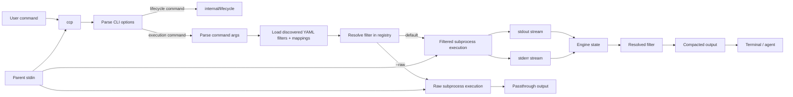

# Command Compression Proxy Architecture

## Purpose

`ccp` is an agent-first command proxy:

- runs native commands
- compacts output to reduce bytes/tokens sent to coding agents
- preserves execution correctness, especially exit code and actionable diagnostics

The steady-state architecture is now one canonical runtime under `internal/`
plus authored YAML filters under `filters/`.

## High-Level Components

- `cmd/ccp`: CLI entrypoint and runtime wiring
- `cmd/coverage-gate`: coverage gate CLI for enforcing internal package thresholds
- `internal/`: canonical runtime packages
- `internal/contracts`: stable runtime command/filter contracts
- `internal/engine`: streaming engine and ordered retained-output buffer
- `internal/filters`: filter sources, registry helpers, and compiled runtime filter implementations
- `internal/filters/yaml`: authored YAML schema, validation, loading, and compilation
- `internal/metrics`: runtime metric persistence and gain/history reporting
- `internal/lifecycle`: lifecycle subcommands and coding-agent integration entrypoints
- `internal/lifecycle/agents`: coding-agent specific adapters
- `filters/`: repository-authored YAML filter definitions and `.mappings.yaml`
- `cmd/ccp-ci` + `internal/benchmark`: replay benchmark runner for fixture-driven verification and reporting
- `testdata/benchmarks`: benchmark scenarios, replay fixtures, and optional copied projects

## End-to-End Runtime Flow

## Runtime Structure (`internal/`)

The canonical runtime path is:

1. `cmd/ccp` parses CLI flags through `internal/cli`.
2. Execution commands build `internal/contracts.Command` through `internal/parser.go`.
3. `internal/runner.go` loads discovered filters and mappings from configured sources.
4. `internal/engine` creates command state and streams stdout/stderr through the resolved filter.
5. `internal/metrics` records one metrics entry for each non-raw execution command.

There is no second legacy runtime path and no built-in Go filter catalog fallback.

## Filter Discovery and Registry

Authored filter behavior comes from YAML definitions, not Go-authored per-tool
filters.

Discovery rules:

- dev builds may use the repository `filters/` directory as an explicit source
- non-dev builds default to project-level `.ccp/filters` first and home-level `~/.config/ccp/filters` second
- `.mappings.yaml` participates in resolution in each scope
- project-level definitions and mappings override home-level ones
- invalid or ambiguous definitions are excluded safely and fall back to passthrough

The registry always resolves to a filter, defaulting to passthrough when no
valid filter matches.

## Command and Stream Model

The parsed command carries:

- raw input text
- argv
- canonical tool name
- dispatch key once resolved

The engine handles only `stdout` and `stderr` as filterable streams. `stdin`
remains attached directly to the subprocess.

The ordered buffer:

- retains `keep` output in stream-tagged insertion order
- skips blank lines
- flushes retained output on exit in engine-owned order

## Execution Modes

Supported execution flags:

- `--raw`: bypass semantic compaction and pass through native output
- `--capture-raw`: write timestamped raw stdout/stderr capture files while preserving execution semantics
- `--capture-raw-dir`: choose the capture directory
- `--confidential`: redact configured substrings from emitted output and capture artifacts

Lifecycle commands such as `init`, `gain`, `history`, `verify`, `upgrade`, and
`uninstall` are handled by `internal/lifecycle`.

## Benchmark Architecture (`cmd/ccp-ci` + `internal/benchmark`)

The benchmark harness is a separate module and binary path:

- entrypoint: `cmd/ccp-ci`
- replay fixtures loaded from `testdata/benchmarks/<tool>/<case>-<invariant>/command.yaml`

For each replay fixture, the harness runs `ccp verify`, compares authored
expectations when present, records token counts, and writes per-fixture
artifacts.

Artifact contracts:

- optional sequenced `stdout.txt` / `stderr.txt` replay inputs
- optional authored `output.txt` / `decisions.txt` expectations
- generated `verify-output.txt` / `verify-decisions.txt`

The harness is replay-driven and validates the live runtime without copied
projects by default.

## Testing Layers

- unit tests in the narrowest owning package under `internal/`
- runtime tests in `internal/runner_test.go`, `internal/engine/*_test.go`, and `internal/filters/*_test.go`
- lifecycle and adapter tests under `internal/lifecycle` and `internal/lifecycle/agents`
- benchmark harness tests under `internal/benchmark`
- benchmark fixtures under `testdata/benchmarks`
- validation and race/coverage gates through `./scripts/validate.sh`

## Design Invariants

- exit code parity with the native command
- preserve critical diagnostics
- exact `--raw` behavior unless explicit confidential redaction is enabled
- fallback/passthrough on ambiguity, unsafe structured modes, or invalid filter definitions
- deterministic output and deterministic benchmark evaluation
- authored YAML is the source of truth for filter behavior, while Go owns the bounded runtime semantics
