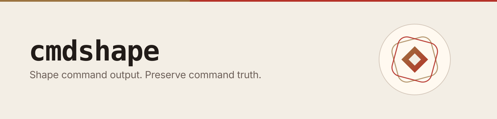

<p align="center">
  <a href="https://github.com/SuppieRK/cmdshape">
    <picture>
      <source srcset="assets/readme-banner.svg">
      
    </picture>
  </a>
</p>

<p align="center">
  <a href="./LICENSE"></a>
  <a href="https://github.com/SuppieRK/cmdshape/releases"></a>
  <a href="https://github.com/SuppieRK/cmdshape/actions/workflows/main-validation.yml"></a>
  <a href="https://sonarcloud.io/summary/new_code?id=SuppieRK_cmdshape"></a>
</p>

## cmdshape for coding agents.

Shape command output. Preserve command truth.

Own deterministic YAML filters, verify them against real output, and keep passthrough when exactness matters.

Use it directly as `cmdshape <command>`, or install integrations and keep your usual command shape.

Validated on every build across the shipped filter inventory and replay
corpus. The generated runtime inventory is available in
[docs/generated/CLI_FACTS.md](docs/generated/CLI_FACTS.md).

## See It Work

If you only read one thing, read this.

<table>
  <tr>
    <td valign="top">
      <strong><code>git status</code></strong>
      <pre lang="text"><code>On branch main
Your branch is up to date with 'origin/main'.

Changes not staged for commit:
  (use "git add &lt;file&gt;..." to update what will be committed)
  ...
        modified:   README.md
        modified:   internal/lifecycle/gain.go
        ...

Untracked files:
  ...
        internal/lifecycle/report_text.go</code></pre>
    </td>
    <td valign="top">
      <strong><code>cmdshape git status</code></strong>
      <pre lang="text"><code>## main...origin/main
 M README.md
 M internal/lifecycle/gain.go
 M internal/lifecycle/gain_global.go
 M internal/lifecycle/gain_test.go
?? internal/lifecycle/report_text.go</code></pre>
    </td>
  </tr>
</table>

Same command. Same result. Less ceremony.

## Output Contract

If output gets compacted too aggressively, the model ends up reconstructing missing context from hints. That is where confusion, extra follow-up commands, and wasted tokens tend to come from. cmdshape is designed to avoid that failure mode.

- Preserve exit codes and critical diagnostics.
- Compact output into a shorter view that still looks like the command it came from.
- Fall back to native output for ambiguous, structured, precision-sensitive, or machine-oriented cases.
- Leave `--raw` available when exact output matters.
- Let teams tune domain-specific logs with YAML instead of relying on guessed summaries.

The goal is not maximum compression. The goal is a smaller output you can still use.

## Quick Start

Install cmdshape:

```bash
curl -fsSL https://raw.githubusercontent.com/SuppieRK/cmdshape/main/scripts/install.sh | sh
```

The installer is also the supported migration path from prior installations.
It converts known state, replaces managed integrations, and removes obsolete
executables only when their project ownership can be verified.

Try it on a normal command:

```bash
cmdshape git status
```

Want it wired into supported tools too?

```bash
cmdshape init --tools claude,codex,opencode
# or: cmdshape init
```

`cmdshape init` installs or refreshes integrations in their normal locations. You do not need to run it in every repo. Use `--tools` when you want an explicit one-time setup; omit it when you want cmdshape to auto-detect supported tools from the current repository.

After `cmdshape init`, supported tools can keep the normal command shape for you.

Want a quick check after using it for a bit?

```bash
cmdshape gain
```

Need exact native output for a comparison or edge case?

```bash
cmdshape --raw git status
```

## Reporting And Real-World Proof

Two real `cmdshape gain` snapshots from day-to-day work:

- Refactoring tests in a Java project with Gradle (Claude Code):

> Here Claude heavily uses `find` in a suboptimal way and runs Gradle builds to implement the task - good noise reduction opportunity

```text
88 cmds · 5,330,571 → 90,127 tokens (98.3% saved)

Wins  : find (4.8m / 99%) · gradle (367k / 87%) · grep (6k / 1%)
Drag  : cd (23 cmds) · jar (21 cmds) · grep (4 cmds)
Trend : ↑ +12.4 pts week over week (85.9% → 98.3%) · on a roll
```

- Current repository snapshot from `cmdshape gain` (Codex):

> Here Codex heavily uses `sed` to read files and runs `grep`/`go`/`git` - reading files is passthrough by default, only some outputs were safe to reduce

```text
1,825 cmds · 2,461,959 → 2,160,427 tokens (12.3% saved)

Wins  : grep (67k / 60%) · go (54k / 90%) · git (16k / 59%)
Drag  : sed (765 cmds) · openspec (245 cmds)
Trend : ↓ -2.1 pts week over week (14.4% → 12.3%) · slipping
```

Detailed views stay bounded by default, so they do not take over the terminal:

```bash
cmdshape gain --table
cmdshape history
```

Use `--limit 0` when you want the full-text table. JSON and CSV exports ignore `--limit`.

That mix is the point. cmdshape can save a lot, and it also knows when not to fake it.

Useful commands:

```bash
cmdshape gain --global
cmdshape history --global
cmdshape history purge --before 90d --yes
cmdshape recovery enable
cmdshape recovery list
cmdshape repair
cmdshape uninstall --tools codex
cmdshape uninstall
```

Successful pre-1.0 upgrades run rewrite repair through the newly installed binary, including guarded current-repository cmdshape migrations. Downgrades are rejected by `cmdshape upgrade`; uninstall and reinstall explicitly if you need an older version.

Project metrics are private, crash-safe, and retained for 90 days. A
project-local spool preserves concurrent writes while the database is busy;
pending events are consolidated on later commands. Raw failure recovery is
disabled by default. When explicitly enabled, it stores only bounded,
failed-and-compacted command output and excludes raw, passthrough,
confidential, zero-byte, and oversized runs. Use `cmdshape recovery purge` to
remove those artifacts.

## Own The Compression Rules

Own your compression logic: author filters in YAML, ship overridden behavior with your repo, share filters across your team, and fix your edge case today instead of waiting for upstream.

Two filter scopes are built in:

- project-local filters in `./.cmdshape/filters`
- home-scoped filters in `~/.config/cmdshape/filters`

Project-local filters are meant to be committed when they describe repo behavior. cmdshape-generated repo-local state, such as `./.cmdshape/gain.db`, is ignored by a cmdshape-owned `./.cmdshape/.gitignore`; cmdshape does not need to append broad `.cmdshape` rules to your repository root `.gitignore` for metrics.

Use `cmdshape filter prompt` to print an embedded, agent-ready workflow for creating or improving filters. The workflow starts by copying any matching global/home filter into `./.cmdshape/filters` before editing; global filters are not edited unless you explicitly ask for a global change.

`cmdshape capture` writes private (`0700` directory, `0600` files) native and
replayed stream fixtures. Captures may contain source, paths, credentials, or
other sensitive output. Use
`cmdshape capture --confidential value1,value2 -- <command>` to replace known
literal values before they are persisted; review every capture before
committing it.

Release builds ignore project-local filters until you approve their exact
current bytes with `cmdshape filter trust`. Approval is scoped to the canonical
project directory and covers every YAML file plus `.mappings.yaml`; additions,
removals, renames, mapping edits, or content edits change the status to
`changed` and require approval again. Use `cmdshape filter status` to inspect the
decision and `cmdshape filter untrust` to remove approval. Home filters remain
available while project filters are absent, untrusted, changed, or unsafe.

Once trusted, project scope overrides home scope. That gives you a clean model:

- experiment in one repo without touching anything else
- ship shared defaults across a team
- keep repo-specific overrides without forks
- handle domain-specific logs without pretending one generic filter fits every project

Read more details in [FILTERS.md](FILTERS.md)

The execution hot path resolves the invoked command and loads only its
effective filter from each source. Full inventory scans remain limited to
administrative commands such as filter status and repair.

## Capability Matrix

| Area              | Tools                                                                                                                                                        |    Representative Savings |
|-------------------|--------------------------------------------------------------------------------------------------------------------------------------------------------------|--------------------------:|
| Files/search      | `find`, `grep`, `ls`                                                                                                                                         |              up to `95%+` |
| Source control    | `git`                                                                                                                                                        |                 `10-60%+` |
| Build systems     | `maven`, `gradle`, `sbt`, `bazel`                                                                                                                            |                 `50-95%+` |
| JS/TS             | `biome`, `bun`, `eslint`, `jest`, `npm`, `nx`, `oxlint`, `pnpm`, `turbo`, `yarn`, `npx`, `node`, `next`, `prettier`, `playwright`, `prisma`, `tsc`, `vitest` |                 `15-85%+` |
| PHP               | `composer`                                                                                                                                                   |                 `10-30%+` |
| Python            | `basedpyright`, `pip`, `poetry`, `pytest`, `mypy`, `ruff`, `ty`, `uv`                                                                                        |                 `25-85%+` |
| Config lint       | `yamllint`, `shellcheck`, `hadolint`                                                                                                                         |                 `10-40%+` |
| Infra and IaC     | `helm`, `terraform`, `tofu`, `tflint`                                                                                                                        |                  `5-90%+` |
| Go/Rust           | `go`, `golangci-lint`, `cargo`, `trunk`                                                                                                                      |                 `35-90%+` |
| Dart/Flutter      | `dart`, `flutter`                                                                                                                                            |                 `35-85%+` |
| Containers        | `docker`                                                                                                                                                     | `95%+` for build surfaces |
| Embedded/Firmware | `pio`                                                                                                                                                        |                 `10-40%+` |
| Elixir            | `mix`                                                                                                                                                        |                  `5-80%+` |
| Other runtimes    | `deno`                                                                                                                                                       |                  `5-80%+` |

Structured, precision, and already-compact modes are intentionally left native when compression would reduce trust.

cmdshape also integrates with `aider`, `amazon-q`, `antigravity`, `auggie`, `claude`, `cline`, `codebuddy`, `codex`, `crush`, `cursor`, `factory`, `gemini`, `github-copilot`, `kiro`, `kilocode`, `opencode`, `pi`, `qoder`, `qwen`, `roocode`, `trae`, `windsurf`, plus `costrict` as an alias for `roocode`.

## License

See [LICENSE](LICENSE).
